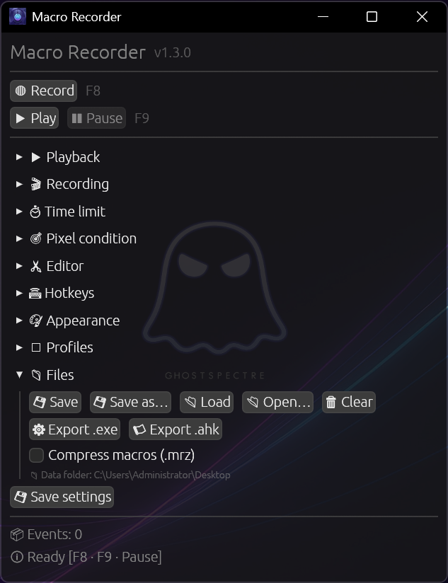
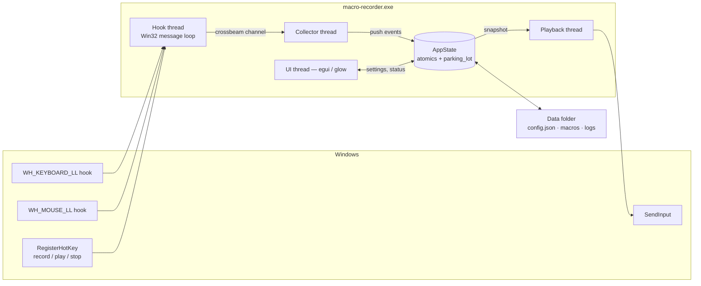
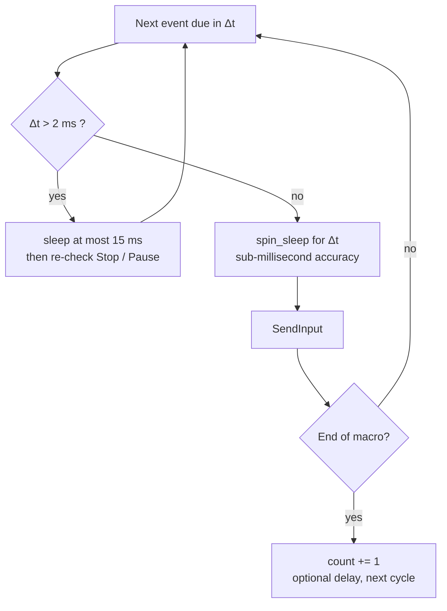
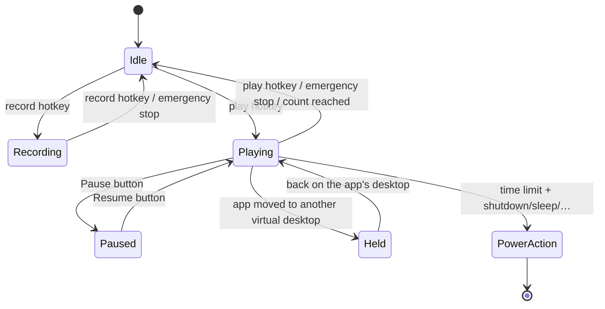

<div align="center">


# 🦀 Macro Recorder

**A modern, open-source alternative to TinyTask.**
*Born from Roblox grind. Forged in Rust.*

[](LICENSE)
[]()
[]()
[]()
[](https://github.com/blackixxce12/macro-recorder/releases)

*Record mouse & keyboard → replay it forever, exactly N times, or until a timer runs out → go drink some tea.* ☕

[📥 Download](../../releases) • [✨ Features](#-features) • [🆚 vs TinyTask](#-macro-recorder-vs-tinytask) • [🧠 How it works](#-how-it-works) • [🇷🇺 Русская версия](README_RU.md)



</div>

---

## 🆕 Highlights

| | |
|---|---|
| ✂ **Built-in editor** | Browse the event list, delete or crop a range, insert a pause, rescale timings, strip mouse movement — with undo |
| ⚙ **Compile to a standalone .exe** | Export a self-running player. No compiler involved: the macro is appended to a copy of this executable |
| 📜 **AutoHotkey export** | Turn any recording into a readable AHK v2 script |
| 🖥 **Tray icon** | Right-click menu for record / play / stop, and an optional "close button minimizes to tray" |
| ⚓ **Window anchoring** | Remembers the target window and shifts every coordinate if it has moved since recording |
| 🎯 **Pixel stop condition** | Watch a screen pixel and stop (or shut down) when it changes — pick it with a 3-second countdown |
| 🗂 **Settings profiles** | Save named configurations: farming, testing, office |
| ⌨ **Press-any-key binding** | Any key can now be a hotkey, plus a dedicated global pause key |
| 🌍 **External translations** | Drop `lang/xx.json` next to the exe to override any string without rebuilding |

<details>
<summary>Under the hood</summary>

Pause/resume with a proper schedule clock · rebindable hotkeys + emergency stop · X1/X2 capture ·
Open/Save dialogs and recent files · gzip `.mrz` macros · shutdown/restart/sleep/hibernate/log-off ·
headless CLI · Fluent (Mica) theme · timing jitter · single instance · log file · the application icon ·
and a long bug hunt: saved settings now apply on startup, Stop reacts in ~15 ms, held keys can't stay
stuck, and hotkeys no longer end up inside your macro.

</details>

---

## 📑 Contents

- [The story](#-the-story-roblox-anime-tower-defenses-and-a-tired-hand)
- [Why Rust](#-why-rust)
- [Macro Recorder vs TinyTask](#-macro-recorder-vs-tinytask)
- [Features](#-features)
- [How it works](#-how-it-works)
- [Hotkeys](#️-hotkeys)
- [Themes](#-themes)
- [Languages](#-languages)
- [Editor, exports & extras](#-editor-exports--extras)
- [Files & folders](#-files--folders)
- [Command line](#-command-line)
- [Download](#-download)
- [Build from source](#️-build-from-source)
- [Known limitations](#️-known-limitations)
- [FAQ](#-faq)
- [License & credits](#-license--credits)

---

## 📖 The story: Roblox, anime tower defenses, and a tired hand

I play a lot of **Roblox** — especially anime tower defense games. If you've ever played one, you know *the loop*:

> Place units → wait for the wave → collect gems → upgrade → repeat.
> And again. And again. **Hundreds of times per session.**

One evening, after manually clicking the same "summon / upgrade / claim" buttons for the third hour in a row, my hand said *«no»*. So I did what everyone does — I downloaded **TinyTask**.

And honestly? **It worked.** TinyTask is a genuinely great piece of software: 36 KB of hand-written C that has been quietly automating people's work since the Windows XP era. It's a masterclass in minimalism, and this project would not exist without it.

But minimalism cuts both ways. After a few evenings of farming I kept hitting the same walls:

- ⏰ **No "stop after N hours"** — I wanted to farm while asleep and have the PC shut itself down afterwards. TinyTask can loop forever or loop N times, but it has no concept of *time*;
- 🖥️ **Absolute pixel coordinates, no DPI awareness** — change Windows scaling from 100% to 125%, dock a laptop, or move the game to another monitor, and every click lands in the wrong place;
- 🔒 **Closed source** — a tool that installs global keyboard hooks and injects synthetic input into my system is exactly the kind of tool I'd like to be able to *read*;
- 🧾 **Binary `.rec` files** — I wanted to tweak a macro in a text editor, not re-record it;
- 🌍 **No Russian / Ukrainian / Chinese UI** — TinyTask ships localized builds, but only for a handful of Western European languages;
- 🎨 **A fixed toolbar from 2007** — which is charming, but I stare at this window for hours, and I wanted it to look like it belongs on Windows 11.

So I built the tool I wanted:

- loops **forever**, **exactly N times**, *or* **until a time limit expires** — and can **shut down the PC** afterwards;
- is **per-monitor DPI aware**, so scaling and multi-monitor setups don't silently break your macros;
- stays **on top of the game window** with an optional **translucent Mica/Acrylic UI**;
- stores macros as **plain JSON** you can open, diff, and edit by hand;
- and is **fully open** — anyone can read, build and audit it.

That weekend project got slightly out of hand. 🦀

---

## 🦀 Why Rust?

| Reason | What it means for you |
|---|---|
| **Single .exe** | No installer, no .NET, no Python runtime — one file, double-click, done |
| **Fearless concurrency** | Four roles run in parallel — low-level hooks, an event collector, a microsecond-accurate replay engine, and the GPU-rendered UI — and the compiler guarantees they don't corrupt each other's state |
| **Memory safety** | A tool that injects input into your system shouldn't scribble over an event buffer mid-raid. Outside the thin `unsafe` Win32 FFI layer, Rust makes whole classes of bugs impossible |
| **Small & instant** | With `opt-level = "z"` + LTO + `strip`, the whole app is a few MB and starts instantly |
| **Honest reason** | I wanted a real excuse to learn Rust properly. Best way to learn — build something you actually use |

---

## 🆚 Macro Recorder vs TinyTask

> **This table is fact-checked** against TinyTask's official website, changelog, FAQ and support pages (see [Sources](#sources-for-the-tinytask-column)). TinyTask is *not* a bad program — it's a deliberately minimal one. Where it wins, this table says so.

### Pick the right tool

| Pick **TinyTask** if… | Pick **Macro Recorder** if… |
|---|---|
| You need the smallest possible footprint (36 KB) | You want timed playback, pause/resume and power actions |
| You need to run on Windows XP / Vista / 7 | You're on Windows 10 / 11 with DPI scaling or multiple monitors |
| You want a 36 KB tool that also compiles macros to 60 KB executables | You want an editor, a tray icon, window anchoring and pixel conditions |
| You want a tool that has been battle-tested for over a decade | You want open source you can audit, fork and extend |
| You just need "record → play", nothing more | You want themes, translucency, 6 UI languages and a headless CLI |

### Full comparison

| | **TinyTask 1.77** | **Macro Recorder** |
|---|---|---|
| **License** | Freeware, **closed source** (proprietary) | **MIT, fully open source** |
| **Implementation** | Pure C + raw Win32, self-contained **32-bit** exe | Rust 2024 + `windows-rs`, **64-bit** exe |
| **Binary size** | **~36 KB** 🏆 | ≈5 MB (GPU UI, 9 themes, 6 translations) |
| **Install** | Portable single exe (optional Inno Setup installer) | Portable single exe |
| **Supported Windows** | **XP → 11** 🏆 | 10 / 11 (Windows 11 for Mica/Acrylic + virtual desktops) |
| **UI** | Fixed Win32 toolbar, user-swappable toolbar bitmaps | GPU-rendered `egui`, **9 themes**, live theme switching |
| **Window translucency** | ❌ | ✅ per-pixel alpha + **DWM Mica / Acrylic** |
| **UI languages** | Separate **localized builds** (FR, DE, IT, PT, ES, SV) since v1.74 — no in-app switch | **6 languages switchable at runtime** (EN, RU, UK, PT, ES, ZH) + auto-detect |
| **Keyboard capture** | ✅ | ✅ virtual key **+ scancode + extended flag** |
| **Mouse move & clicks** | ✅ | ✅ (L / R / M) |
| **Mouse wheel** | ⚠️ documented as unavailable with some mice | ✅ **vertical + horizontal** |
| **X1 / X2 side buttons** | ❌ | ✅ recorded and replayed |
| **Ignores its own injected input** | not documented | ✅ `LLKHF_INJECTED` / `LLMHF_INJECTED` filtered |
| **Hotkeys excluded from recordings** | ✅ by design | ✅ |
| **Repeat playback** | ✅ continuous **or** N times | ✅ continuous **or** N times (1–9999) |
| **Delay between loops** | ❌ (bake it into the recording) | ✅ 0–600 000 ms |
| **Pause / resume** | ❌ | ✅ without losing the position |
| **Stop after a time limit** | ❌ | ✅ **hours : minutes : seconds** |
| **Action when the limit is hit** | ❌ | ✅ stop · **shut down · restart · sleep · hibernate · log off** |
| **Playback speed** | ✅ presets (½×, 1×, 2×, 100×) + custom value | ✅ **0.1× – 3.0×** slider |
| **Timing jitter** | ❌ | ✅ optional 0–50 % per-event randomisation |
| **Live recording timer** | ❌ (playback shows a countdown since v1.61) | ✅ live timer while recording + final duration |
| **Live playback counter** | ❌ | ✅ `plays: 7 / 50` in the UI |
| **Global hotkeys** | `Ctrl+Alt+Shift+R` / `Ctrl+Shift+Alt+P`, a few alternatives in Prefs | ✅ **rebindable** (22 keys × Ctrl/Alt/Shift), applied without restart |
| **Emergency stop key** | ✅ Break / ScrollLock / Pause | ✅ **Pause/Break** by default, rebindable |
| **Always on top** | ✅ (since v1.61) | ✅ toggle at runtime |
| **Settings persistence** | ✅ portable `.ini` (since v1.50) | ✅ human-readable **`config.json`** + autosave on exit |
| **Macro format** | Proprietary binary `.rec` | **Plain JSON** with µs timestamps, optional gzip (`.mrz`) |
| **Edit a recording** | ❌ in the classic build (a "With Editor" build exists on the official site) | ✅ **built-in editor** + any text editor |
| **Open / Save dialogs, recent files** | ✅ open & save | ✅ + a recent-files list |
| **Compile macro → standalone .exe** | ✅ ~60 KB output 🏆 | ✅ ~5 MB output (a copy of this exe + the macro) |
| **Export to another tool** | ❌ | ✅ **AutoHotkey v2 script** |
| **Tray icon / minimize to tray** | ❌ | ✅ with a record / play / stop menu |
| **Window anchoring** | ❌ | ✅ follows the target window if it moved |
| **Stop on a screen pixel** | ❌ | ✅ colour + tolerance, with a picker |
| **Settings profiles** | ❌ | ✅ named, unlimited |
| **User translations without a rebuild** | ❌ | ✅ `lang/xx.json` overrides |
| **Headless / scriptable run** | ❌ (the compiled .exe covers this) | ✅ `--play … --loops … --no-gui` |
| **Single-instance guard** | ❌ | ✅ focuses the running window |
| **Per-monitor DPI awareness** | ❌ raw pixel coordinates; scaling changes shift every click | ✅ **Per-Monitor v2** + coordinates normalized across the whole virtual desktop |
| **Relative (delta) mouse mode** | ❌ | ✅ toggle — useful for FPS-style camera input |
| **Virtual Desktop isolation (Win 11)** | ❌ | ✅ recording & playback pause when the app isn't on the active desktop |
| **Timing model** | Faithful replay of recorded timing | µs timestamps + `timeBeginPeriod(1)` + hybrid sleep / spin-sleep scheduler |
| **Log file** | ❌ | ✅ rotating daily log |
| **Scripting / conditional logic** | ❌ | ❌ (both are recorders, not automation languages — use AutoHotkey for that) |
| **Antivirus false positives** | ⚠️ a known, long-standing issue | ⚠️ same — any input injector looks suspicious |
| **Price** | Free | **Free forever** |

### Where TinyTask still wins 🏆

Credit where it's due — two things TinyTask does that this project cannot:

1. **Size and reach.** 36 KB, 32-bit, runs on Windows XP. Its compiled macros are ~60 KB;
   ours are a ~5 MB copy of this executable, because the player *is* the whole app.
   If you need to email a macro to someone on an old machine, TinyTask wins outright.
2. **A decade of field testing.** TinyTask has been used by an enormous number of people for
   many years. Macro Recorder is young — please [file issues](../../issues).

### Sources for the TinyTask column

Facts above were taken from the official TinyTask site rather than SEO mirrors (several of which contradict each other and the vendor's own changelog):

- Official changelog — <https://www.tinytask.net/revision_history.html>
- Official FAQ — <https://www.tinytask.net/faq.html>
- Official support page (hotkeys, emergency stop) — <https://www.tinytask.net/support.html>
- Official downloads (v1.77, "With Editor" builds) — <https://www.tinytask.net/download.html>
- The Portable Freeware Collection entry — <https://www.portablefreeware.com/index.php?id=1853>

---

## ✨ Features

**Capture**

- 🔴 Mouse movement, clicks, wheel (vertical *and* horizontal), **X1/X2 side buttons**, and the full keyboard — including scancodes and extended keys, so layouts and NumPad behave correctly
- 🎚 Movement sampling is configurable (1–100 ms, default 5 ms), or can be **switched off entirely** for click-only macros
- 🚫 The recorder ignores its own synthetic events *and* your own hotkeys, so neither ends up inside the macro

**Replay**

- ▶ Microsecond scheduling: a 1 ms system timer plus a hybrid sleep/spin-sleep loop, so long macros don't drift
- 🔁 Loop forever, **exactly N times** (1–9999), or **until a time limit**, with an optional delay between loops
- ⏸ **Pause and resume** — the schedule clock stops with you, so nothing fast-forwards afterwards
- ⚡ Speed **0.1× – 3.0×**, plus optional **timing jitter** (0–50 %)
- 🖱 Absolute or relative mouse mode
- 🛟 Stop always releases whatever the macro was holding down — no stuck Shift, no stuck mouse button

**Automation & safety**

- ⏱ Time limit in `H : M : S`, then: stop · shut down · restart · sleep · hibernate · log off
- ⏳ Shutdown/restart use a visible countdown (0–600 s, default 60) — `shutdown /a` still aborts it
- 🧭 **Per-monitor DPI aware (v2)** — Windows reports true physical pixels, so 125%/150% scaling doesn't silently offset your clicks
- 🪟 **Virtual Desktop isolation (Windows 11)** — if the app lives on Desktop 2, it neither records nor replays while you're working on Desktop 1
- 🔒 **Single instance** — launching it twice just focuses the existing window

**Interface & files**

- ⌨ Rebindable global hotkeys: record, play, and a dedicated **emergency stop** (default `F6` / `F7` / `F8` / `F9`)
- 📌 Always on Top toggle
- 🎨 **9 themes** + a transparent UI switch, with Windows 11 **Mica** and **Acrylic** backdrops (and a blur fallback on Windows 10)
- 🌍 **6 languages**, auto-detected and switchable at runtime
- 📦 Macros as plain JSON — or gzipped `.mrz` when size matters — with Open/Save dialogs and a recent-files list
- 💾 Settings in a readable `config.json`, saved on demand and on exit
- 📝 A rotating daily log file for when something behaves oddly
- 🖥 A headless CLI for scripts and scheduled tasks
- ✂ A built-in editor, `.exe` and AutoHotkey export, a tray icon, settings profiles and
  drop-in translations — see [Editor, exports & extras](#-editor-exports--extras)

---

## 🧠 How it works

### Architecture



Nothing blocks the UI, and nothing blocks the hook callback — a low-level hook that stalls gets silently dropped by Windows. So the callback does the absolute minimum: two atomic loads, a cached window handle, a cached virtual-desktop answer, then it hands the event off through a lock-free channel.

### The replay scheduler

Naive `sleep()` loops drift badly over a two-hour macro, and a single long `sleep()` makes the Stop key feel broken. The engine schedules every event against one monotonic clock and never sleeps for more than ~15 ms at a time:



`timeBeginPeriod(1)` is requested for the duration of playback only and released afterwards, so the app doesn't keep the whole system on a high-resolution timer while idle.

### State machine



Entering **Paused** or **Held** releases anything the macro was holding down and freezes the schedule clock — so returning after ten minutes resumes exactly where you left off instead of replaying ten minutes of backlog at full speed.

---

## ⌨️ Hotkeys

| Action | Default | Notes |
|---|---|---|
| Start / stop **recording** | `F6` | Rebindable |
| Start / stop **playback** | `F7` | Rebindable |
| **Emergency stop** | `F9` | Stops recording *and* playback |
| Pause / resume playback | `F8` | Rebindable, or use the UI button |

All three are registered globally with `MOD_NOREPEAT`, so they work while any application has focus, and they are filtered out of the recording. Each can be combined with **Ctrl**, **Alt** and **Shift**, and changes apply immediately — no restart.

Click the key button and press anything — letters, digits, function keys. While binding, the global
hotkeys are released so you can even swap `F6` and `F7` around; Esc or 15 seconds of silence cancels.
The ▾ list next to it covers keys the window never receives, such as `Pause`, `ScrollLock` and the
NumPad. **Clear** unbinds a slot entirely.

> If another application already owns one of your combinations, the app says so under **⌨ Hotkeys** instead of failing silently — pick a different key or add a modifier.

---

## 🎨 Themes

| # | Theme | Notes |
|---|---|---|
| 0 | **Dark** | The default. Neutral grays, subtle shadows |
| 1 | **OLED (Pure Black)** | `#000000` panels, zero shadows — true black pixels stay off |
| 2 | **Material Design 3** | 20 px rounded widgets, and it **reads your Windows accent colour** from the registry |
| 3 | **Catppuccin Mocha** | The pastel favourite |
| 4 | **Nord** | Cold arctic blues |
| 5 | **Dracula** | Purple/pink on deep gray |
| 6 | **Glassmorphism** | Translucent panels + **DWM Acrylic** system backdrop |
| 7 | **Neumorphism** | The only light theme — soft shadows on `#E0E5EC` |
| 8 | **Fluent (Mica)** | Windows 11 **Mica** backdrop + your system accent colour |

The **Transparent UI** checkbox works on top of any theme. Glass requests Acrylic and Fluent requests Mica through `DwmSetWindowAttribute`; if the attribute isn't supported (Windows 10), the app falls back to classic `DwmEnableBlurBehindWindow`. Switching *away* from a backdrop theme now removes the effect properly.

---

## 🌍 Languages

`English` · `Русский` · `Українська` · `Português` · `Español` · `中文`

The UI language is detected from `GetUserDefaultUILanguage()` on first launch and can be overridden in the dropdown at any time — no restart. CJK glyphs are loaded from the system fonts (`msyh.ttc`, `simhei.ttf`, `meiryo.ttc`) when present.

---

## 🧰 Editor, exports & extras

### ✂ Editor

Everything happens on the loaded macro, and every action is undoable one step back.
Pick a range with the `from` / `to` fields (or click a row in the list), then:

| Action | What it does |
|---|---|
| **Delete** | Removes the range *and pulls the tail back*, so no silent gap is left behind |
| **Keep only** | Crops to the range and rebases it to t = 0 |
| **Drop moves** | Strips every mouse-movement event, leaving clicks and keys |
| **Trim lead-in** | Shifts everything so the first event happens immediately |
| **Insert pause** | Adds N ms at the selection point and shifts the rest |
| **Scale time ×** | Multiplies every timestamp — 2.0 makes the macro permanently twice as slow |

The editor is disabled while recording or playing.

### ⚙ Export to a standalone `.exe`

**Files → Export .exe** produces a player that runs on any Windows PC with nothing installed.
It works by copying this executable and appending the macro to it: a PE image ignores trailing
bytes, which is the same trick self-extracting archives use — no compiler or linker is involved.
On startup the player finds its own footer and plays immediately; the emergency-stop hotkey
still works. The current loop count, speed, mouse mode and inter-loop delay are baked in.

### 📜 Export to AutoHotkey

**Files → Export .ahk** writes an AutoHotkey v2 script: `MouseMove` / `Click` / `Send` with
`Sleep` between events, wrapped in a `Loop`, and `Esc` bound to exit. Keys are emitted as
`{vkXX}` so non-US layouts survive the trip.

### 🖥 Tray

Enabled in **Appearance**. Left-click toggles the window, right-click opens a menu with
record / play / emergency stop / exit. Turn on *"Close button minimizes to tray"* and the ✕
hides the window instead of quitting — useful for multi-hour unattended runs.

### ⚓ Window anchoring

A macro stores absolute screen coordinates, so moving the target window normally breaks it.
Anchoring fixes that.

Turn on **Remember the target window** (off by default) and the moment you start recording, the
app notes the title and position of whatever window was in the foreground — the game, the browser,
whatever you were about to click on. That pair is saved inside the macro file.

Later, with **Follow the anchored window** enabled, playback finds that window by title, measures
how far it has moved since the recording, and shifts every coordinate by the same offset. Drag the
window to the other half of the screen and the macro still lands on the same buttons. If the window
isn't open, playback runs unshifted and says so in the log.

It's off by default because it stores a window title inside your macro file, and because a macro
recorded across several windows (or on the desktop itself) is better left unanchored.

### 🎯 Pixel stop condition

Watch one screen pixel and stop when it matches a colour (or stops matching). Press
**Pick in 3 s**, hover the target, and both the coordinates and the colour are captured.
Tolerance is a per-channel ±value. The condition is polled about four times a second and,
when it fires, runs the same end action as the timer — so *"stop farming when the HP bar
turns red, then shut down"* is two checkboxes.

### 🗂 Profiles

Save the entire configuration under a name into `profiles/<name>.json` and switch between
setups with one click. Recent files are kept across switches.

### 🌍 Translations without a rebuild

Press **Export language template** to write `lang/xx.template.json` — a flat key/value dump of
every UI string. Translate the values, rename it to `lang/xx.json` (`en`, `ru`, `uk`, `pt`,
`es`, `zh`), and restart: your strings replace the built-in ones. Empty values and missing keys
fall back to the defaults, so a partial translation is fine.

---

## 📁 Files & folders

### Where things live

The app picks its data folder at startup and shows the result under **📁 Files**:

1. **Next to the executable** — if that folder is writable (fully portable: USB sticks, `Downloads`, a game folder);
2. otherwise **`%APPDATA%\MacroRecorder\`** — so it still works from `Program Files` or a read-only location.

```
<data folder>/
├── config.json                  settings
├── macro.json                   default macro slot
├── my-farm.mrz                  gzipped macro (optional)
├── profiles/
│   └── farming.json             named settings profiles
├── lang/
│   └── ru.json                  optional translation overrides
└── logs/
    └── macro-recorder.log.YYYY-MM-DD
```

### `macro.json` — the recording (format v2)

`t_us` is microseconds since the recording started; `kind` is an externally-tagged enum. `duration_us` is the full length of the recording **including trailing idle time**, which is what makes a "do stuff, then wait 5 seconds" macro loop correctly.

```json
{
  "version": 2,
  "duration_us": 8000000,
  "events": [
    { "t_us": 0,      "kind": { "MouseMove":   { "x": 960, "y": 540, "dx": 0, "dy": 0 } } },
    { "t_us": 128340, "kind": { "MouseButton": { "button": "Left", "down": true,  "x": 960, "y": 540 } } },
    { "t_us": 190002, "kind": { "MouseButton": { "button": "Left", "down": false, "x": 960, "y": 540 } } },
    { "t_us": 512900, "kind": { "Key":         { "vk": 65, "scan": 30, "down": true,  "extended": false } } },
    { "t_us": 560110, "kind": { "Key":         { "vk": 65, "scan": 30, "down": false, "extended": false } } },
    { "t_us": 900000, "kind": { "MouseWheel":  { "delta": 120, "x": 960, "y": 540, "horizontal": false } } },
    { "t_us": 950000, "kind": { "MouseButton": { "button": "X1", "down": true, "x": 960, "y": 540 } } }
  ]
}
```

| Field | Meaning |
|---|---|
| `t_us` | Timestamp in microseconds from the start of the recording |
| `Key.vk` / `Key.scan` | Virtual-key code and hardware scancode. **Scancode wins on replay** when non-zero — that's what makes games and non-US layouts behave |
| `Key.extended` | Extended-key flag (arrows, NumPad Enter, right Ctrl/Alt…) |
| `MouseMove.x/y` | Absolute screen coordinates (used in absolute mode) |
| `MouseMove.dx/dy` | Delta since the previous sample (used in relative mode) |
| `MouseButton.button` | `Left` · `Right` · `Middle` · `X1` · `X2` |
| `MouseWheel.delta` | 120 per notch, negative = down/left |
| `MouseWheel.horizontal` | `true` for tilt-wheel / horizontal scroll |

**Compatibility:** version 1 files (a bare `[ … ]` array) still load — they simply have no trailing-pause information. **Compression:** saving with a `.mrz` (or `.gz`) extension writes gzipped compact JSON, typically 20–40× smaller; both extensions load transparently.

**Editing tips:** delete a block of events to trim the macro, multiply every `t_us` by 2 to halve the speed permanently, or duplicate a slice to repeat a sub-sequence. Out-of-order timestamps are sorted on load rather than rejected.

### `config.json` — the settings

Written by **💾 Save Settings** and automatically on exit.

| Key | Type | Default | Meaning |
|---|---|---|---|
| `default_lang` | 0–6 | `0` | `0` = auto, `1` EN, `2` RU, `3` UK, `4` PT, `5` ES, `6` ZH |
| `default_theme` | 0–8 | `0` | Index into the theme table above |
| `transparent_ui` | bool | `true` | Translucent window |
| `always_on_top` | bool | `true` | Keep the window above others |
| `loop_play` | bool | `true` | Infinite looping |
| `play_count_limit` | 1–9999 | `1` | Used when `loop_play` is `false` |
| `speed` | f64 | `1.0` | Playback speed multiplier |
| `absolute_mouse` | bool | `true` | Absolute vs relative mouse replay |
| `repeat_delay_ms` | 0–600000 | `0` | Pause between loops |
| `jitter_pct` | 0–50 | `0` | Per-event timing randomisation |
| `capture_mouse_moves` | bool | `true` | Record movement, not just clicks |
| `mouse_sample_ms` | 1–100 | `5` | Movement sampling interval |
| `time_limit_enabled` | bool | `false` | Enable the playback time limit |
| `time_limit_h` / `_m` / `_s` | u64 | `0` | Hours / minutes / seconds |
| `action_on_completion` | 0–5 | `0` | `0` stop · `1` shut down · `2` restart · `3` sleep · `4` hibernate · `5` log off |
| `shutdown_delay_s` | 0–600 | `60` | Countdown before shutdown/restart |
| `use_window_anchor` | bool | `false` | Shift coordinates if the anchored window moved |
| `record_window_anchor` | bool | `false` | Remember the foreground window when recording starts |
| `tray_enabled` / `close_to_tray` | bool | `true` / `true` | Tray icon; ✕ minimizes instead of quitting |
| `pixel_enabled` | bool | `false` | Stop playback on a screen pixel |
| `pixel_x` / `pixel_y` | i32 | `0` | Watched screen coordinate |
| `pixel_r` / `_g` / `_b` | u8 | `255,0,0` | Target colour |
| `pixel_tolerance` | 0–255 | `20` | Per-channel tolerance |
| `pixel_mode` | 0/1 | `0` | `0` stop when it matches · `1` stop when it differs |
| `hotkey_record` / `hotkey_play` / `hotkey_stop` / `hotkey_pause` | object | F6 / F7 / F9 / F8 | `{ "vk": 117, "ctrl": false, "alt": false, "shift": false }`; `vk: 0` means unbound |
| `recent_files` | array | `[]` | Up to 8 recent macro paths |
| `compress_on_save` | bool | `false` | Default to `.mrz` when saving |

Unknown or out-of-range values are clamped instead of crashing, and missing keys fall back to their defaults — so a config from an older version keeps working.

---

## 💻 Command line

```
macro-recorder [OPTIONS]

  -p, --play <FILE>    Load a macro (.json / .mrz) on start
  -n, --loops <N>      Repeat count (0 = infinite)
  -s, --speed <X>      Playback speed multiplier (0.05 - 10.0)
      --no-gui         Play the macro headless and exit
  -h, --help           Show this help
  -V, --version        Show the version
```

Without `--no-gui` the options simply pre-load the GUI, which is handy for shortcuts:

```powershell
# Preload a macro and start the UI with it
macro-recorder.exe --play "D:\macros\farm.mrz"

# Run it 20 times without a window (Task Scheduler, .bat files, …)
macro-recorder.exe --play "D:\macros\farm.mrz" --loops 20 --speed 1.5 --no-gui
```

The emergency-stop hotkey still works in headless mode.

---

## 📥 Download

Grab the latest `.exe` from the **[Releases](../../releases)** page. No installation needed.

| File | Requires | Notes |
|---|---|---|
| `MacroRecorder.exe` | Any x86-64 CPU | Universal — runs everywhere |
| `MacroRecorder.v3.exe` | AVX2-capable CPU (Intel Haswell 2013+ / AMD Zen+) | Slightly faster on modern CPUs |

> ⚠️ **Antivirus note:** macro tools install global input hooks and inject synthetic input, so unsigned builds get flagged as suspicious. This is a false positive that affects every tool in this category — TinyTask's own changelog has entries about fighting it too. That's exactly why the source is open: [build it yourself](#️-build-from-source) and trust your own binary.

---

## 🛠️ Build from source

```bash
# 1. Install Rust (1.97.1+, edition 2024): https://rustup.rs
# 2. Clone & build
git clone https://github.com/blackixxce12/Macro-Recorder.git
cd Micro-Recorder

# Universal build
cargo build --release

# Optimized build (AVX2, a few % faster on modern CPUs)
# CMD:
set RUSTFLAGS=-C target-cpu=x86-64-v3 && cargo build --release
# PowerShell:
$env:RUSTFLAGS="-C target-cpu=x86-64-v3"; cargo build --release

# Tests (format round-trips, config clamping, scheduler math)
cargo test
```

The binary lands in `target/release/`. Release profile: `opt-level = "z"`, fat LTO, one codegen unit, symbols stripped, `panic = "abort"` — which is why the hook callbacks are written to be panic-free rather than relying on `catch_unwind`.

**Icon:** `build.rs` embeds `assets/icon.ico` into the executable using [`winresource`](https://github.com/BenjaminRi/winresource), which needs a resource compiler — `rc.exe` (Windows SDK, comes with the MSVC toolchain) or `windres.exe` (MinGW). If it isn't found the build still succeeds; you just get a `cargo:warning` and no Explorer icon. The window icon comes from `assets/icon.rgba` and always works. See [`assets/README.md`](assets/README.md) to regenerate them.

To watch what the app is doing, either read `logs/macro-recorder.log.*` or build in debug mode (which keeps a console attached) and set `RUST_LOG=debug`.

---

## ⚠️ Known limitations

Honest list — please read before filing a bug:

| Limitation | Detail |
|---|---|
| **Windows only** | Every capture/replay path goes through Win32. Non-Windows targets compile, but do nothing |
| **Pausing drops a drag in progress** | Held keys and buttons are released when you pause, so a macro paused mid-drag resumes without the drag |
| **One macro at a time** | Open/Save, recent files and profiles, but no tabs or queue |
| **Exported `.exe` is ~5 MB** | The player is a copy of the whole app. TinyTask's ~60 KB output is smaller by design |
| **No TinyTask `.rec` import** | The format is undocumented; a guessed parser would corrupt macros silently rather than fail loudly |
| **Coordinates are screen-absolute** | DPI awareness stops Windows from lying about pixels, but a macro still assumes the same window layout as when it was recorded. Maximize your target window before recording |
| **Elevated windows** | Windows blocks synthetic input into higher-privilege windows. If your target runs as admin, run this as admin too |
| **Anti-cheat** | `SendInput` is standard synthetic input. Many games accept it; kernel-level anti-cheat may detect or block it |
| **Sleep/hibernate depend on the system** | If hibernation is disabled in Windows, that action fails and is logged rather than silently doing something else |
| **No scripting** | No conditions, variables, or image recognition. If you need those, use AutoHotkey |

---

## ❓ FAQ

**Is this an auto-clicker / cheat?**
It's a macro recorder: it replays exactly what *you* did. What you automate is your responsibility — many games and services prohibit automation in their terms of service, and some ban for it. Read the rules of whatever you're automating.

**Why is it 5 MB when TinyTask is 36 KB?**
Because it ships a GPU-accelerated UI toolkit, 9 themes, 6 translations and a power/DPI/virtual-desktop layer. Different trade-off, on purpose. If size is your priority, TinyTask is genuinely the better answer.

**Where did my `config.json` go?**
Next to the exe if that folder is writable, otherwise `%APPDATA%\MacroRecorder\`. The app prints the exact path under **📁 Files**.

**Will my macro survive changing the resolution?**
Coordinates are absolute, so no — re-record after a resolution or monitor-layout change. Changing *DPI scaling* is handled, because the process is Per-Monitor v2 aware.

**Can I stop the auto-shutdown?**
Yes. It uses a system countdown (60 s by default, configurable) with a visible warning. Run `shutdown /a` in a terminal to abort it.

**Does playback record itself into an infinite loop?**
No. Injected events carry the `LLKHF_INJECTED` / `LLMHF_INJECTED` flag and are discarded by the hooks — as are your own hotkeys.

**Does it work in fullscreen games?**
Borderless/windowed-fullscreen works best. Exclusive fullscreen and raw-input games can be inconsistent, as with any `SendInput`-based tool.

**Why is the exported `.exe` so big?**
Because it *is* the whole app with your macro glued to the end — that's what makes it work with
no compiler installed. It plays instantly and needs nothing on the target machine.

**Can I edit a macro without a text editor?**
Yes — the built-in editor covers deleting, cropping, inserting pauses and rescaling timings.

**Should I use `.json` or `.mrz`?**
`.json` while you're iterating — you can read and edit it. `.mrz` for long recordings you just want to keep: same data, roughly 20–40× smaller.

---

## 🤝 Contributing

Issues and PRs are welcome — especially for the [roadmap](#-roadmap) items. If you're reporting a playback bug, please attach the macro file (or a trimmed version of it), the relevant part of `logs/macro-recorder.log.*`, and your Windows version, display scaling and monitor layout.

---

## 📜 License & credits

MIT — see [LICENSE](LICENSE). Do what you want; a link back is appreciated.

- **TinyTask** by Vista Software — the inspiration, and still the champion of doing more with less.
- [`egui` / `eframe`](https://github.com/emilk/egui) — the immediate-mode GUI that makes 9 themes a 200-line file.
- [`windows-rs`](https://github.com/microsoft/windows-rs) — official Rust bindings for the Win32 API.
- [`spin_sleep`](https://github.com/alexheretic/spin-sleep), [`crossbeam-channel`](https://github.com/crossbeam-rs/crossbeam), [`parking_lot`](https://github.com/Amanieu/parking_lot) — the reason the timing is boringly reliable.
- [`rfd`](https://github.com/PolyMeilex/rfd), [`flate2`](https://github.com/rust-lang/flate2-rs), [`tracing`](https://github.com/tokio-rs/tracing), [`winresource`](https://github.com/BenjaminRi/winresource) — dialogs, compression, logs, icon.

<div align="center">

**If this saved your wrist, leave a ⭐ — it's the only currency this project accepts.**

</div>

