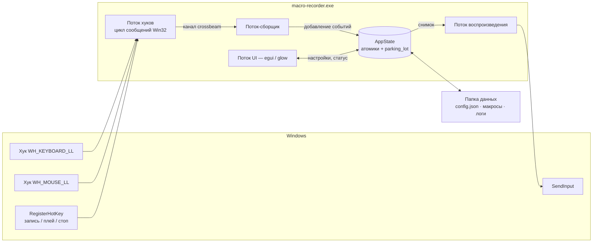
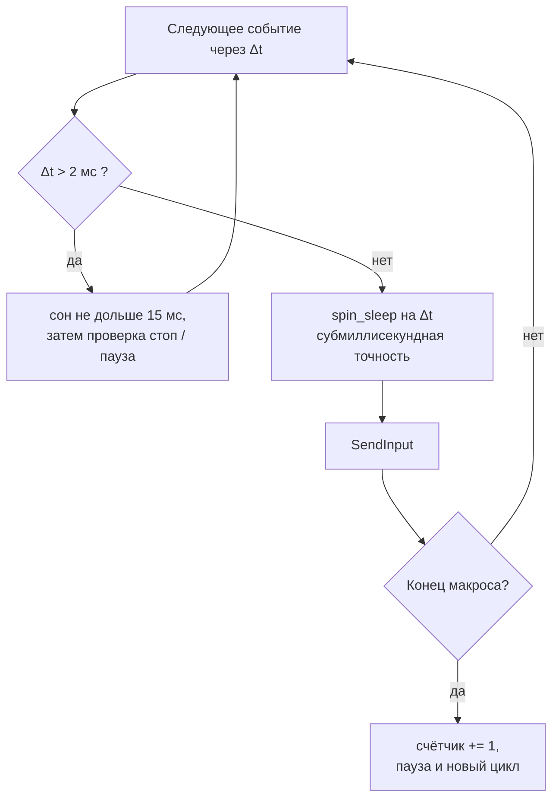
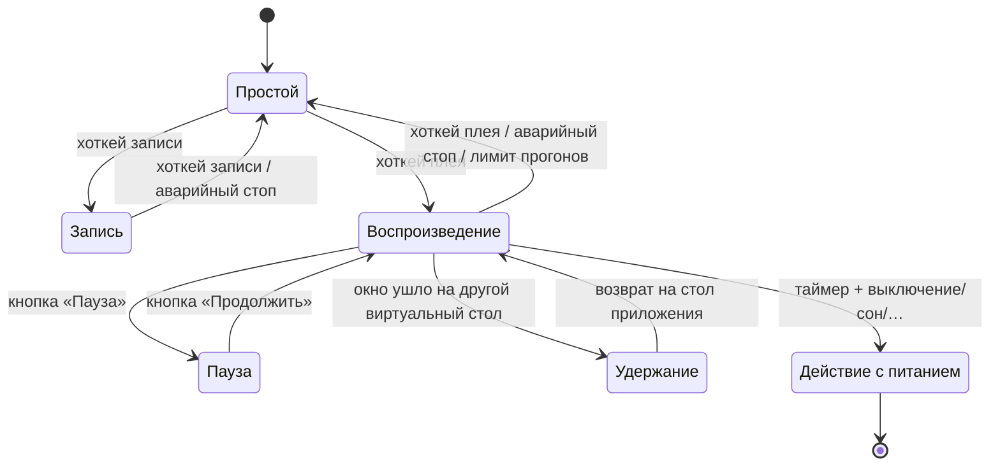

<div align="center">


# 🦀 Macro Recorder

**Современная открытая альтернатива TinyTask.**
*Рождён в гринде Roblox. Выкован на Rust.*

[](LICENSE)
[]()
[]()
[]()
[](https://github.com/blackixxce12/Micro-Recorder/releases)

*Записал мышь и клавиатуру → повторяй бесконечно, ровно N раз или до истечения таймера → иди пить чай.* ☕

[📥 Скачать](../../releases) • [✨ Возможности](#-возможности) • [🆚 vs TinyTask](#-macro-recorder-vs-tinytask) • [🧠 Как это работает](#-как-это-работает) • [🇬🇧 English version](README.md)


</div>

---

## 🆕 Что нового в 1.3

| | |
|---|---|
| ✂ **Встроенный редактор** | Список событий, удаление и обрезка диапазона, вставка пауз, масштаб таймингов, снятие движений мыши — с отменой |
| ⚙ **Компиляция в отдельный .exe** | Экспорт самозапускающегося плеера. Компилятор не нужен: макрос дописывается в копию этого исполняемого файла |
| 📜 **Экспорт в AutoHotkey** | Любая запись превращается в читаемый скрипт AHK v2 |
| 🖥 **Значок в трее** | Меню записи / плея / стопа и опция «крестик сворачивает в трей» |
| ⚓ **Привязка к окну** | Запоминает целевое окно и сдвигает все координаты, если оно переехало |
| 🎯 **Условие по пикселю** | Следит за пикселем экрана и останавливается (или выключает ПК), когда тот меняется; захват с отсчётом 3 с |
| 🗂 **Профили настроек** | Именованные конфигурации: фарм, тесты, офис |
| ⌨ **Привязка любой клавиши** | Хоткеем может быть что угодно, плюс отдельная глобальная клавиша паузы |
| 🌍 **Внешние переводы** | Положите `lang/xx.json` рядом с exe и переопределите любую строку без пересборки |

<details>
<summary>Что принесла 1.3</summary>

Пауза/продолжение с корректными часами расписания · переназначаемые хоткеи и аварийный стоп ·
запись X1/X2 · диалоги файлов и недавние · сжатие `.mrz` · выключение/перезагрузка/сон/гибернация/выход ·
запуск без окна · тема Fluent (Mica) · джиттер · один экземпляр · файл журнала · иконка приложения ·
и большая охота на баги: сохранённые настройки применяются при старте, стоп срабатывает за ~15 мс,
зажатые клавиши не залипают, хоткеи не попадают в макрос.

</details>

---

## 📑 Содержание

- [История](#-история-roblox-аниме-тавер-дефенсы-и-уставшая-рука)
- [Почему Rust](#-почему-rust)
- [Macro Recorder vs TinyTask](#-macro-recorder-vs-tinytask)
- [Возможности](#-возможности)
- [Как это работает](#-как-это-работает)
- [Горячие клавиши](#️-горячие-клавиши)
- [Темы](#-темы)
- [Языки](#-языки)
- [Редактор, экспорт и прочее](#-редактор-экспорт-и-прочее)
- [Файлы и папки](#-файлы-и-папки)
- [Командная строка](#-командная-строка)
- [Скачать](#-скачать)
- [Сборка из исходников](#️-сборка-из-исходников)
- [Известные ограничения](#️-известные-ограничения)
- [FAQ](#-faq)
- [Лицензия и благодарности](#-лицензия-и-благодарности)

---

## 📖 История: Roblox, аниме тавер-дефенсы и уставшая рука

Я много играю в **Roblox** — особенно в аниме tower defense. Если вы играли хоть в один, вы знаете *этот цикл*:

> Поставить юнитов → дождаться волны → собрать гемы → апнуть → повторить.
> И снова. И снова. **Сотни раз за сессию.**

Однажды вечером, отщёлкав третий час подряд одни и те же кнопки «саммон / апгрейд / забрать», моя рука сказала *«нет»*. И я сделал то, что делают все — скачал **TinyTask**.

И, если честно, **он работал**. TinyTask — по-настоящему хорошая программа: 36 КБ написанного вручную кода на C, который тихо автоматизирует чужую работу со времён Windows XP. Это эталон минимализма, и без него этого проекта бы не было.

Но у минимализма есть обратная сторона. Через пару вечеров фарма я уперся в одни и те же стены:

- ⏰ **Нет «остановиться через N часов»** — я хотел фармить во сне и чтобы ПК сам выключился. TinyTask умеет крутить бесконечно или N раз, но понятия *времени* у него нет;
- 🖥️ **Абсолютные пиксельные координаты без DPI-осведомлённости** — поменяйте масштаб Windows со 100% на 125%, воткните ноутбук в док или перетащите игру на другой монитор, и все клики уедут мимо;
- 🔒 **Закрытый исходный код** — программу, которая ставит глобальные хуки на клавиатуру и вбрасывает синтетический ввод в мою систему, очень хочется иметь возможность *прочитать*;
- 🧾 **Бинарные файлы `.rec`** — я хотел подправить макрос в текстовом редакторе, а не перезаписывать его заново;
- 🌍 **Нет русского / украинского / китайского интерфейса** — у TinyTask есть локализованные сборки, но только для нескольких западноевропейских языков;
- 🎨 **Фиксированный тулбар из 2007-го** — по-своему обаятельный, но я смотрю в это окно часами и хотел, чтобы оно выглядело как приложение для Windows 11.

Так что я собрал инструмент, который хотел сам:

- крутит **бесконечно**, **ровно N раз** *или* **до истечения таймера** — и умеет **выключить ПК** после;
- **понимает DPI каждого монитора отдельно**, поэтому масштабирование и мультимонитор не ломают макросы молча;
- держится **поверх окна игры**, с опциональным **полупрозрачным Mica/Acrylic-интерфейсом**;
- хранит макросы в **обычном JSON**, который можно открыть, сравнить и поправить руками;
- и **полностью открыт** — любой может прочитать, собрать и проверить его.

Проект на выходные слегка вышел из-под контроля. 🦀

---

## 🦀 Почему Rust?

| Причина | Что это даёт вам |
|---|---|
| **Один .exe** | Ни установщика, ни .NET, ни Python-рантайма — один файл, двойной клик, готово |
| **Бесстрашная многопоточность** | Параллельно работают четыре роли — низкоуровневые хуки, сборщик событий, микросекундный движок воспроизведения и GPU-интерфейс — а компилятор гарантирует, что они не портят состояние друг друга |
| **Безопасность памяти** | Программа, вбрасывающая ввод в систему, не должна затирать буфер событий посреди рейда. За пределами тонкого слоя `unsafe` Win32 FFI целые классы багов просто невозможны |
| **Маленький и мгновенный** | С `opt-level = "z"` + LTO + `strip` всё приложение весит несколько МБ и стартует мгновенно |
| **Честная причина** | Мне нужен был реальный повод нормально выучить Rust. Лучший способ учиться — писать то, чем сам пользуешься |

---

## 🆚 Macro Recorder vs TinyTask

> **Эта таблица сверена** с официальным сайтом TinyTask, его changelog, FAQ и страницей поддержки (см. [Источники](#источники-по-колонке-tinytask)). TinyTask — *не* плохая программа, а намеренно минималистичная. Там, где он выигрывает, таблица так и говорит.

### Что выбрать

| Берите **TinyTask**, если… | Берите **Macro Recorder**, если… |
|---|---|
| Нужен минимальный размер (36 КБ) | Нужны таймер, пауза и действия с питанием ПК |
| Нужна работа на Windows XP / Vista / 7 | У вас Windows 10 / 11 с масштабированием или несколькими мониторами |
| Нужен инструмент на 36 КБ, который к тому же собирает макросы в 60 КБ | Нужны редактор, трей, привязка к окну и условия по пикселю |
| Нужен инструмент, обкатанный больше десяти лет | Нужен открытый код, который можно проверить, форкнуть и расширить |
| Нужно просто «записал → воспроизвёл», и ничего больше | Хотите темы, прозрачность, 6 языков интерфейса и запуск из консоли |

### Полное сравнение

| | **TinyTask 1.77** | **Macro Recorder 1.3** |
|---|---|---|
| **Лицензия** | Freeware, **закрытый исходный код** | **MIT, полностью открытый код** |
| **Реализация** | Чистый C + голый Win32, самодостаточный **32-битный** exe | Rust 2024 + `windows-rs`, **64-битный** exe |
| **Размер бинарника** | **~36 КБ** 🏆 | ≈5 МБ (GPU-интерфейс, 9 тем, 6 переводов) |
| **Установка** | Портативный один exe (опционально — установщик Inno Setup) | Портативный один exe |
| **Поддержка Windows** | **XP → 11** 🏆 | 10 / 11 (Windows 11 — для Mica/Acrylic и виртуальных рабочих столов) |
| **Интерфейс** | Фиксированный Win32-тулбар, сменные картинки кнопок | GPU-рендер на `egui`, **9 тем**, смена темы на лету |
| **Прозрачность окна** | ❌ | ✅ пиксельная альфа + **DWM Mica / Acrylic** |
| **Языки интерфейса** | Отдельные **локализованные сборки** (FR, DE, IT, PT, ES, SV) с v1.74 — переключения внутри программы нет | **6 языков переключаются на лету** (EN, RU, UK, PT, ES, ZH) + автоопределение |
| **Запись клавиатуры** | ✅ | ✅ виртуальная клавиша **+ скан-код + флаг extended** |
| **Движения и клики мыши** | ✅ | ✅ (ЛКМ / ПКМ / СКМ) |
| **Колесо мыши** | ⚠️ по документации не пишется с некоторыми мышами | ✅ **вертикальное + горизонтальное** |
| **Боковые кнопки X1 / X2** | ❌ | ✅ записываются и воспроизводятся |
| **Игнорирует собственный ввод** | не документировано | ✅ фильтр `LLKHF_INJECTED` / `LLMHF_INJECTED` |
| **Хоткеи не попадают в запись** | ✅ по устройству программы | ✅ (исправлено в 1.3) |
| **Повтор воспроизведения** | ✅ бесконечно **или** N раз | ✅ бесконечно **или** N раз (1–9999) |
| **Пауза между циклами** | ❌ (закладывается в саму запись) | ✅ 0–600 000 мс |
| **Пауза / продолжение** | ❌ | ✅ без потери позиции |
| **Остановка по таймеру** | ❌ | ✅ **часы : минуты : секунды** |
| **Действие по достижении лимита** | ❌ | ✅ остановить · **выключить · перезагрузить · сон · гибернация · выйти из системы** |
| **Скорость воспроизведения** | ✅ пресеты (½×, 1×, 2×, 100×) + своё значение | ✅ ползунок **0.1× – 3.0×** |
| **Джиттер таймингов** | ❌ | ✅ опционально 0–50 % на событие |
| **Таймер записи в реальном времени** | ❌ (при воспроизведении есть обратный отсчёт, с v1.61) | ✅ живой таймер записи + итоговая длительность |
| **Счётчик прогонов** | ❌ | ✅ `проигрываний: 7 / 50` прямо в интерфейсе |
| **Глобальные горячие клавиши** | `Ctrl+Alt+Shift+R` / `Ctrl+Shift+Alt+P`, несколько вариантов в Prefs | ✅ **переназначаемые** (22 клавиши × Ctrl/Alt/Shift), применяются без перезапуска |
| **Аварийная остановка** | ✅ Break / ScrollLock / Pause | ✅ **Pause/Break** по умолчанию, переназначается |
| **Поверх всех окон** | ✅ (с v1.61) | ✅ переключается на лету |
| **Сохранение настроек** | ✅ портативный `.ini` (с v1.50) | ✅ читаемый **`config.json`** + автосохранение при выходе |
| **Формат макроса** | Проприетарный бинарный `.rec` | **Обычный JSON** с микросекундными метками, опционально gzip (`.mrz`) |
| **Правка записи** | ❌ в классической сборке (на офсайте есть сборка «With Editor») | ✅ **встроенный редактор** + любой текстовый редактор |
| **Диалоги открытия/сохранения, недавние** | ✅ открытие и сохранение | ✅ + список недавних файлов |
| **Компиляция макроса в .exe** | ✅ ~60 КБ на выходе 🏆 | ✅ ~5 МБ на выходе (копия этого exe + макрос) |
| **Экспорт в другой инструмент** | ❌ | ✅ **скрипт AutoHotkey v2** |
| **Трей и сворачивание в него** | ❌ | ✅ с меню записи / плея / стопа |
| **Привязка к окну** | ❌ | ✅ следует за целевым окном, если оно переехало |
| **Остановка по пикселю экрана** | ❌ | ✅ цвет + допуск, с захватом |
| **Профили настроек** | ❌ | ✅ именованные, без ограничений |
| **Переводы без пересборки** | ❌ | ✅ переопределение через `lang/xx.json` |
| **Запуск без окна / из скрипта** | ❌ (эту роль играет скомпилированный exe) | ✅ `--play … --loops … --no-gui` |
| **Защита от второго запуска** | ❌ | ✅ активирует уже открытое окно |
| **DPI-осведомлённость по мониторам** | ❌ сырые пиксельные координаты; смена масштаба сдвигает все клики | ✅ **Per-Monitor v2** + нормализация координат по всему виртуальному экрану |
| **Относительный (дельта) режим мыши** | ❌ | ✅ переключатель — удобно для обзора камеры в шутерах |
| **Изоляция виртуальных столов (Win 11)** | ❌ | ✅ запись и воспроизведение приостанавливаются, если приложение не на активном столе |
| **Модель тайминга** | Точное воспроизведение записанных пауз | Микросекундные метки + `timeBeginPeriod(1)` + гибридный планировщик sleep / spin-sleep |
| **Файл журнала** | ❌ | ✅ с ежедневной ротацией |
| **Скрипты и условия** | ❌ | ❌ (оба — рекордеры, а не языки автоматизации; для этого есть AutoHotkey) |
| **Ложные срабатывания антивирусов** | ⚠️ известная давняя проблема | ⚠️ то же самое — любой инжектор ввода выглядит подозрительно |
| **Цена** | Бесплатно | **Бесплатно навсегда** |

### В чём TinyTask всё ещё лучше 🏆

Отдадим должное — две вещи, которых этот проект не может:

1. **Размер и охват.** 36 КБ, 32 бита, работает на Windows XP. Его скомпилированные макросы весят
   ~60 КБ, наши — ~5 МБ, потому что плеером служит всё приложение целиком. Если нужно отправить
   макрос человеку на старой машине — TinyTask выигрывает безоговорочно.
2. **Десятилетие полевых испытаний.** TinyTask прошёл через огромное число пользователей за много
   лет. Macro Recorder молод, так что [пишите issues](../../issues).

### Источники по колонке TinyTask

Факты взяты с официального сайта, а не с SEO-зеркал (некоторые из них противоречат друг другу и официальному changelog):

- Официальный changelog — <https://www.tinytask.net/revision_history.html>
- Официальный FAQ — <https://www.tinytask.net/faq.html>
- Официальная страница поддержки (хоткеи, аварийный стоп) — <https://www.tinytask.net/support.html>
- Официальные загрузки (v1.77, сборки «With Editor») — <https://www.tinytask.net/download.html>
- Карточка в The Portable Freeware Collection — <https://www.portablefreeware.com/index.php?id=1853>

---

## ✨ Возможности

**Запись**

- 🔴 Движения мыши, клики, колесо (вертикальное *и* горизонтальное), **боковые кнопки X1/X2** и вся клавиатура — со скан-кодами и флагом extended, поэтому раскладки и NumPad ведут себя правильно
- 🎚 Шаг выборки движений настраивается (1–100 мс, по умолчанию 5 мс) или **отключается совсем** для макросов из одних кликов
- 🚫 Рекордер игнорирует и собственные синтетические события, и ваши хоткеи — ни то, ни другое в макрос не попадает

**Воспроизведение**

- ▶ Микросекундное планирование: системный таймер 1 мс плюс гибридный цикл sleep/spin-sleep, чтобы длинные макросы не «уплывали»
- 🔁 Бесконечно, **ровно N раз** (1–9999) или **до истечения таймера**, с опциональной паузой между циклами
- ⏸ **Пауза и продолжение** — часы расписания встают вместе с вами, поэтому после возврата ничего не «догоняет»
- ⚡ Скорость **0.1× – 3.0×** плюс опциональный **джиттер таймингов** (0–50 %)
- 🖱 Абсолютный или относительный режим мыши
- 🛟 Остановка всегда отпускает всё, что макрос удерживал — никаких залипших Shift и кнопок мыши

**Автоматизация и безопасность**

- ⏱ Лимит времени в формате `Ч : М : С`, затем: остановить · выключить · перезагрузить · сон · гибернация · выйти из системы
- ⏳ Выключение и перезагрузка идут с видимым отсчётом (0–600 с, по умолчанию 60) — `shutdown /a` по-прежнему их отменяет
- 🧭 **Per-Monitor DPI Aware (v2)** — Windows сообщает настоящие физические пиксели, поэтому масштаб 125%/150% не сдвигает клики
- 🪟 **Изоляция виртуальных рабочих столов (Windows 11)** — если приложение живёт на «Столе 2», оно ничего не пишет и не воспроизводит, пока вы работаете на «Столе 1»
- 🔒 **Один экземпляр** — повторный запуск просто активирует уже открытое окно

**Интерфейс и файлы**

- ⌨ Переназначаемые глобальные хоткеи: запись, воспроизведение и отдельный **аварийный стоп** (по умолчанию `F8` / `F9` / `Pause`)
- 📌 Режим «Поверх всех окон»
- 🎨 **9 тем** + переключатель прозрачного интерфейса, с подложками **Mica** и **Acrylic** из Windows 11 (и откатом на размытие в Windows 10)
- 🌍 **6 языков**, определяются автоматически и меняются на лету
- 📦 Макросы в обычном JSON — или в сжатом `.mrz`, когда важен размер — с диалогами открытия/сохранения и списком недавних
- 💾 Настройки в читаемом `config.json`, сохраняются по кнопке и при выходе
- 📝 Файл журнала с ежедневной ротацией — на случай странного поведения
- 🖥 Запуск без окна для скриптов и планировщика задач
- ✂ Встроенный редактор, экспорт в `.exe` и AutoHotkey, трей, профили и подключаемые переводы —
  см. [Редактор, экспорт и прочее](#-редактор-экспорт-и-прочее)

---

## 🧠 Как это работает

### Архитектура



Ничто не блокирует интерфейс и ничто не блокирует колбэк хука — «зависший» низкоуровневый хук Windows молча выбрасывает. Поэтому колбэк делает абсолютный минимум: пара атомарных чтений, закэшированный хэндл окна, закэшированный ответ про виртуальный стол — и передаёт событие дальше через неблокирующий канал.

### Планировщик воспроизведения

Наивные циклы со `sleep()` за два часа макроса уезжают очень заметно, а один длинный `sleep()` создаёт ощущение, что кнопка «стоп» сломана. Движок планирует каждое событие относительно одних монотонных часов и никогда не спит дольше ~15 мс за раз:



`timeBeginPeriod(1)` запрашивается только на время воспроизведения и освобождается после — приложение не держит всю систему на таймере высокого разрешения, пока простаивает.

### Диаграмма состояний



Вход в **Паузу** или **Удержание** отпускает всё, что макрос удерживал, и замораживает часы расписания — поэтому возврат через десять минут продолжает ровно с того же места, а не проигрывает десять минут задолженности на полной скорости.

---

## ⌨️ Горячие клавиши

| Действие | По умолчанию | Комментарий |
|---|---|---|
| Старт / стоп **записи** | `F8` | Переназначается |
| Старт / стоп **воспроизведения** | `F9` | Переназначается |
| **Аварийный стоп** | `Pause` / `Break` | Останавливает и запись, и воспроизведение |
| Пауза / продолжение | не назначено | Переназначается, либо кнопка в окне |

Все три регистрируются глобально с флагом `MOD_NOREPEAT`, поэтому работают, когда активно любое приложение, и отфильтровываются из записи. Каждую можно скомбинировать с **Ctrl**, **Alt** и **Shift**, изменения применяются сразу — без перезапуска.

Нажмите **«Задать»** и любую клавишу — буквы, цифры, функциональные, NumPad, что угодно. Esc
отменяет, **«Сбросить»** снимает привязку. Нажатая при назначении клавиша поглощается и не уходит
в приложение под окном.

> Если комбинацию уже заняла другая программа, приложение скажет об этом в разделе **⌨ Горячие клавиши**, а не промолчит — выберите другую клавишу или добавьте модификатор.

---

## 🎨 Темы

| № | Тема | Комментарий |
|---|---|---|
| 0 | **Dark** | По умолчанию. Нейтральные серые, мягкие тени |
| 1 | **OLED (Pure Black)** | Панели `#000000`, никаких теней — чёрные пиксели реально выключены |
| 2 | **Material Design 3** | Скругления 20 px, и она **берёт цвет акцента Windows** из реестра |
| 3 | **Catppuccin Mocha** | Пастельная классика |
| 4 | **Nord** | Холодные арктические синие |
| 5 | **Dracula** | Фиолетово-розовое на тёмно-сером |
| 6 | **Glassmorphism** | Полупрозрачные панели + системная подложка **DWM Acrylic** |
| 7 | **Neumorphism** | Единственная светлая тема — мягкие тени на `#E0E5EC` |
| 8 | **Fluent (Mica)** | Подложка **Mica** из Windows 11 + системный цвет акцента |

Галочка **«Прозрачный интерфейс»** работает поверх любой темы. Glass запрашивает Acrylic, Fluent — Mica через `DwmSetWindowAttribute`; если атрибут не поддерживается (Windows 10), приложение откатывается на классический `DwmEnableBlurBehindWindow`. Переключение *с* темы с подложкой теперь корректно снимает эффект.

---

## 🌍 Языки

`English` · `Русский` · `Українська` · `Português` · `Español` · `中文`

Язык интерфейса определяется через `GetUserDefaultUILanguage()` при первом запуске и в любой момент меняется в выпадающем списке — без перезапуска. Иероглифы CJK подгружаются из системных шрифтов (`msyh.ttc`, `simhei.ttf`, `meiryo.ttc`), если они есть.

---

## 🧰 Редактор, экспорт и прочее

### ✂ Редактор

Всё работает с загруженным макросом, каждое действие отменяется на шаг назад. Выберите диапазон
полями «с» / «по» (или кликом по строке списка), затем:

| Действие | Что делает |
|---|---|
| **Удалить** | Убирает диапазон *и подтягивает хвост*, чтобы не осталось немой паузы |
| **Оставить только** | Обрезает до диапазона и сдвигает его к t = 0 |
| **Убрать движения** | Вырезает все события движения мыши, оставляя клики и клавиши |
| **Обрезать начало** | Сдвигает всё так, чтобы первое событие происходило сразу |
| **Вставить паузу** | Добавляет N мс в точке выбора и сдвигает остальное |
| **Масштаб времени ×** | Умножает все метки: 2.0 навсегда замедляет макрос вдвое |

Во время записи и воспроизведения редактор заблокирован.

### ⚙ Экспорт в отдельный `.exe`

**Файлы → Экспорт в .exe** создаёт плеер, который запустится на любом Windows-ПК без установки
чего-либо. Работает это так: копируется текущий исполняемый файл, а макрос дописывается в конец —
PE-образ игнорирует хвостовые байты, тем же приёмом пользуются самораспаковывающиеся архивы.
Ни компилятор, ни линковщик не задействованы. При старте плеер находит свой футер и сразу играет;
хоткей аварийной остановки продолжает работать. Текущие число повторов, скорость, режим мыши и
пауза между циклами запекаются внутрь.

### 📜 Экспорт в AutoHotkey

**Файлы → Экспорт в .ahk** пишет скрипт AutoHotkey v2: `MouseMove` / `Click` / `Send` с `Sleep`
между событиями, обёрнутые в `Loop`, и `Esc` для выхода. Клавиши выводятся как `{vkXX}`, поэтому
не-US раскладки переживают перенос.

### 🖥 Трей

Включается в разделе «Оформление». Левый клик сворачивает и разворачивает окно, правый открывает
меню: запись / плей / аварийный стоп / выход. Включите «крестик сворачивает в трей» — и ✕ будет
прятать окно вместо выхода. Удобно для многочасовых прогонов.

### ⚓ Привязка к окну

Когда включено «Запоминать целевое окно», старт записи сохраняет заголовок и позицию окна, которое
было на переднем плане. Если затем включить «Следовать за окном привязки», воспроизведение найдёт
это окно, вычислит, насколько оно сместилось, и сдвинет на столько же все абсолютные координаты.
Передвиньте окно игры — макрос всё равно попадёт по кнопкам.

### 🎯 Условие по пикселю

Следит за одним пикселем экрана и останавливается, когда тот совпадает с цветом (или перестаёт
совпадать). Нажмите **«Взять через 3 с»**, наведите курсор — координаты и цвет захватятся вместе.
Допуск задаётся как ±значение на канал. Условие опрашивается примерно четыре раза в секунду и при
срабатывании выполняет то же действие, что и таймер, — так что «остановить фарм, когда полоска HP
покраснела, и выключить ПК» — это две галочки.

### 🗂 Профили

Сохраняйте всю конфигурацию под именем в `profiles/<имя>.json` и переключайтесь одним кликом.
Список недавних файлов при переключении сохраняется.

### 🌍 Переводы без пересборки

Нажмите **«Выгрузить шаблон перевода»** — появится `lang/xx.template.json` с плоским списком всех
строк интерфейса. Переведите значения, переименуйте в `lang/xx.json` (`en`, `ru`, `uk`, `pt`, `es`,
`zh`) и перезапустите: ваши строки заменят встроенные. Пустые значения и отсутствующие ключи
берутся из значений по умолчанию, так что частичный перевод — это нормально.

---

## 📁 Файлы и папки

### Где что лежит

Приложение выбирает папку данных при старте и показывает результат в разделе **📁 Файлы**:

1. **Рядом с исполняемым файлом** — если туда можно писать (полностью портативно: флешки, `Downloads`, папка игры);
2. иначе **`%APPDATA%\MacroRecorder\`** — чтобы работало и из `Program Files`, и из папки только для чтения.

```
<папка данных>/
├── config.json                  настройки
├── macro.json                   слот макроса по умолчанию
├── my-farm.mrz                  сжатый макрос (опционально)
├── profiles/
│   └── farming.json             именованные профили настроек
├── lang/
│   └── ru.json                  необязательные переопределения перевода
└── logs/
    └── macro-recorder.log.YYYY-MM-DD
```

### `macro.json` — запись (формат v2)

`t_us` — микросекунды с начала записи; `kind` — enum с внешним тегом. `duration_us` — полная длина записи **вместе с хвостовым ожиданием**, именно она заставляет корректно зацикливаться макрос вида «сделать дела, потом подождать 5 секунд».

```json
{
  "version": 2,
  "duration_us": 8000000,
  "events": [
    { "t_us": 0,      "kind": { "MouseMove":   { "x": 960, "y": 540, "dx": 0, "dy": 0 } } },
    { "t_us": 128340, "kind": { "MouseButton": { "button": "Left", "down": true,  "x": 960, "y": 540 } } },
    { "t_us": 190002, "kind": { "MouseButton": { "button": "Left", "down": false, "x": 960, "y": 540 } } },
    { "t_us": 512900, "kind": { "Key":         { "vk": 65, "scan": 30, "down": true,  "extended": false } } },
    { "t_us": 560110, "kind": { "Key":         { "vk": 65, "scan": 30, "down": false, "extended": false } } },
    { "t_us": 900000, "kind": { "MouseWheel":  { "delta": 120, "x": 960, "y": 540, "horizontal": false } } },
    { "t_us": 950000, "kind": { "MouseButton": { "button": "X1", "down": true, "x": 960, "y": 540 } } }
  ]
}
```

| Поле | Значение |
|---|---|
| `t_us` | Метка времени в микросекундах от начала записи |
| `Key.vk` / `Key.scan` | Код виртуальной клавиши и аппаратный скан-код. **При воспроизведении приоритет у скан-кода**, если он ненулевой — именно это заставляет корректно работать игры и не-US раскладки |
| `Key.extended` | Флаг расширенной клавиши (стрелки, Enter на NumPad, правые Ctrl/Alt…) |
| `MouseMove.x/y` | Абсолютные экранные координаты (абсолютный режим) |
| `MouseMove.dx/dy` | Смещение относительно предыдущей выборки (относительный режим) |
| `MouseButton.button` | `Left` · `Right` · `Middle` · `X1` · `X2` |
| `MouseWheel.delta` | 120 на «щелчок», отрицательное — вниз/влево |
| `MouseWheel.horizontal` | `true` для горизонтальной прокрутки |

**Совместимость:** файлы версии 1 (голый массив `[ … ]`) по-прежнему читаются — в них просто нет информации о хвостовой паузе. **Сжатие:** при сохранении с расширением `.mrz` (или `.gz`) пишется gzip-сжатый компактный JSON, обычно в 20–40 раз меньше; оба расширения читаются автоматически.

**Советы по правке:** удалите блок событий, чтобы обрезать макрос; умножьте все `t_us` на 2, чтобы навсегда замедлить его вдвое; продублируйте фрагмент, чтобы повторить под-последовательность. Нарушенный порядок меток при загрузке сортируется, а не отвергается.

### `config.json` — настройки

Записывается кнопкой **💾 Сохранить настройки** и автоматически при выходе.

| Ключ | Тип | По умолчанию | Значение |
|---|---|---|---|
| `default_lang` | 0–6 | `0` | `0` = авто, `1` EN, `2` RU, `3` UK, `4` PT, `5` ES, `6` ZH |
| `default_theme` | 0–8 | `0` | Индекс из таблицы тем выше |
| `transparent_ui` | bool | `true` | Полупрозрачное окно |
| `always_on_top` | bool | `true` | Держать окно поверх остальных |
| `loop_play` | bool | `true` | Бесконечный цикл |
| `play_count_limit` | 1–9999 | `1` | Используется, когда `loop_play` = `false` |
| `speed` | f64 | `1.0` | Множитель скорости |
| `absolute_mouse` | bool | `true` | Абсолютное или относительное воспроизведение мыши |
| `repeat_delay_ms` | 0–600000 | `0` | Пауза между циклами |
| `jitter_pct` | 0–50 | `0` | Рандомизация задержек на событие |
| `capture_mouse_moves` | bool | `true` | Записывать движения, а не только клики |
| `mouse_sample_ms` | 1–100 | `5` | Шаг выборки движений |
| `time_limit_enabled` | bool | `false` | Включить лимит времени воспроизведения |
| `time_limit_h` / `_m` / `_s` | u64 | `0` | Часы / минуты / секунды |
| `action_on_completion` | 0–5 | `0` | `0` остановить · `1` выключить · `2` перезагрузить · `3` сон · `4` гибернация · `5` выйти из системы |
| `shutdown_delay_s` | 0–600 | `60` | Отсчёт до выключения/перезагрузки |
| `use_window_anchor` | bool | `false` | Сдвигать координаты, если окно привязки переехало |
| `record_window_anchor` | bool | `true` | Запоминать окно переднего плана при старте записи |
| `tray_enabled` / `close_to_tray` | bool | `true` / `false` | Значок в трее; ✕ сворачивает вместо выхода |
| `pixel_enabled` | bool | `false` | Останавливать воспроизведение по пикселю |
| `pixel_x` / `pixel_y` | i32 | `0` | Отслеживаемая координата экрана |
| `pixel_r` / `_g` / `_b` | u8 | `255,0,0` | Целевой цвет |
| `pixel_tolerance` | 0–255 | `20` | Допуск на канал |
| `pixel_mode` | 0/1 | `0` | `0` стоп при совпадении · `1` стоп при расхождении |
| `hotkey_record` / `hotkey_play` / `hotkey_stop` / `hotkey_pause` | объект | F8 / F9 / Pause / — | `{ "vk": 119, "ctrl": false, "alt": false, "shift": false }`; `vk: 0` — не назначено |
| `recent_files` | массив | `[]` | До 8 путей к недавним макросам |
| `compress_on_save` | bool | `false` | По умолчанию сохранять в `.mrz` |

Неизвестные значения и выход за диапазон обрезаются вместо падения, а отсутствующие ключи берутся из значений по умолчанию — конфиг от старой версии продолжает работать.

---

## 💻 Командная строка

```
macro-recorder [OPTIONS]

  -p, --play <FILE>    Загрузить макрос (.json / .mrz) при старте
  -n, --loops <N>      Число повторов (0 = бесконечно)
  -s, --speed <X>      Множитель скорости (0.05 - 10.0)
      --no-gui         Проиграть макрос без окна и выйти
  -h, --help           Показать справку
  -V, --version        Показать версию
```

Без `--no-gui` параметры просто предзагружают интерфейс — удобно для ярлыков:

```powershell
# Предзагрузить макрос и открыть окно
macro-recorder.exe --play "D:\macros\farm.mrz"

# Прогнать 20 раз без окна (планировщик задач, .bat-файлы, …)
macro-recorder.exe --play "D:\macros\farm.mrz" --loops 20 --speed 1.5 --no-gui
```

Хоткей аварийной остановки работает и в режиме без окна.

---

## 📥 Скачать

Берите свежий `.exe` со страницы **[Releases](../../releases)**. Установка не нужна.

| Файл | Требования | Комментарий |
|---|---|---|
| `MacroRecorder.exe` | Любой x86-64 CPU | Универсальный — работает везде |
| `MacroRecorder.v3.exe` | CPU с AVX2 (Intel Haswell 2013+ / AMD Zen+) | Чуть быстрее на современных процессорах |

> ⚠️ **Про антивирусы:** макрорекордеры ставят глобальные хуки ввода и вбрасывают синтетические события, поэтому неподписанные сборки помечаются как подозрительные. Это ложное срабатывание, которое касается всей категории — в changelog самого TinyTask есть записи о борьбе с тем же самым. Именно поэтому исходники открыты: [соберите сами](#️-сборка-из-исходников) и доверяйте своему бинарнику.

---

## 🛠️ Сборка из исходников

```bash
# 1. Установите Rust (1.97.1+, edition 2024): https://rustup.rs
# 2. Клонируйте и соберите
git clone https://github.com/blackixxce12/Micro-Recorder.git
cd Micro-Recorder

# Универсальная сборка
cargo build --release

# Оптимизированная сборка (AVX2, на несколько % быстрее на современных CPU)
# CMD:
set RUSTFLAGS=-C target-cpu=x86-64-v3 && cargo build --release
# PowerShell:
$env:RUSTFLAGS="-C target-cpu=x86-64-v3"; cargo build --release

# Тесты (форматы, обрезка конфига, математика планировщика)
cargo test
```

Бинарник появится в `target/release/`. Release-профиль: `opt-level = "z"`, полный LTO, один codegen unit, символы вырезаны, `panic = "abort"` — именно поэтому колбэки хуков написаны без паник, а не полагаются на `catch_unwind`.

**Иконка:** `build.rs` встраивает `assets/icon.ico` в исполняемый файл через [`winresource`](https://github.com/BenjaminRi/winresource), которому нужен компилятор ресурсов — `rc.exe` (Windows SDK, идёт с MSVC-тулчейном) или `windres.exe` (MinGW). Если его нет, сборка всё равно проходит: вы получите `cargo:warning` и останетесь без иконки в проводнике. Иконка окна берётся из `assets/icon.rgba` и работает всегда. Как их пересоздать — см. [`assets/README.md`](assets/README.md).

Чтобы посмотреть, что делает приложение, читайте `logs/macro-recorder.log.*` или соберите в debug-режиме (там остаётся консоль) с `RUST_LOG=debug`.

---

## ⚠️ Известные ограничения

Честный список — прочитайте перед тем, как заводить issue:

| Ограничение | Подробности |
|---|---|
| **Только Windows** | Все пути записи и воспроизведения идут через Win32. Не-Windows цели компилируются, но ничего не делают |
| **Пауза рвёт начатое перетаскивание** | При паузе зажатые клавиши и кнопки отпускаются, поэтому макрос, поставленный на паузу посреди drag'а, продолжится уже без него |
| **Один макрос за раз** | Есть открытие/сохранение, недавние и профили, но нет вкладок и очереди |
| **Экспортированный `.exe` весит ~5 МБ** | Плеером служит копия всего приложения. У TinyTask ~60 КБ — и это его преимущество |
| **Нет импорта TinyTask `.rec`** | Формат не документирован; парсер «на глазок» портил бы макросы молча, а не падал бы честно |
| **Координаты абсолютные (экранные)** | DPI-осведомлённость не даёт Windows врать о пикселях, но макрос всё равно рассчитывает на ту же раскладку окон, что при записи. Разворачивайте целевое окно на весь экран перед записью |
| **Окна с повышенными правами** | Windows блокирует синтетический ввод в окна с более высокими привилегиями. Если цель запущена от админа — запускайте и рекордер от админа |
| **Античиты** | `SendInput` — стандартный синтетический ввод. Многие игры его принимают, но античит уровня ядра может его обнаружить или заблокировать |
| **Сон и гибернация зависят от системы** | Если гибернация отключена в Windows, действие завершится ошибкой и попадёт в лог, а не сделает молча что-то другое |
| **Никаких скриптов** | Ни условий, ни переменных, ни распознавания картинок. Если нужно это — берите AutoHotkey |

---

## ❓ FAQ

**Это автокликер / чит?**
Это макрорекордер: он воспроизводит ровно то, что сделали *вы*. Что именно вы автоматизируете — ваша ответственность: многие игры и сервисы запрещают автоматизацию в правилах пользования, а некоторые за неё банят. Читайте правила того, что автоматизируете.

**Почему 5 МБ, если TinyTask весит 36 КБ?**
Потому что здесь внутри GPU-ускоренный UI-тулкит, 9 тем, 6 переводов и слой работы с питанием, DPI и виртуальными столами. Это осознанно другой компромисс. Если для вас критичен размер — TinyTask действительно лучший ответ.

**Куда делся мой `config.json`?**
Он рядом с exe, если туда можно писать, иначе в `%APPDATA%\MacroRecorder\`. Точный путь приложение показывает в разделе **📁 Файлы**.

**Переживёт ли макрос смену разрешения?**
Координаты абсолютные, так что нет — после смены разрешения или раскладки мониторов запишите заново. А вот смена *масштаба DPI* обрабатывается, потому что процесс объявлен Per-Monitor v2 Aware.

**Можно ли отменить авто-выключение?**
Да. Используется системный обратный отсчёт (60 секунд по умолчанию, настраивается) с видимым предупреждением. Выполните `shutdown /a` в терминале, чтобы отменить.

**Не запишет ли воспроизведение само себя по кругу?**
Нет. Вброшенные события несут флаг `LLKHF_INJECTED` / `LLMHF_INJECTED` и отбрасываются хуками — как и ваши собственные хоткеи.

**Работает ли в полноэкранных играх?**
Лучше всего — в безрамочном/оконно-полноэкранном режиме. Эксклюзивный полный экран и игры на raw input могут вести себя нестабильно, как и с любым инструментом на `SendInput`.

**Почему экспортированный `.exe` такой большой?**
Потому что это и есть всё приложение с приклеенным в конец макросом — именно поэтому оно работает
без установленного компилятора. Запускается мгновенно и ничего не требует на целевой машине.

**Можно править макрос без текстового редактора?**
Да, встроенный редактор умеет удалять, обрезать, вставлять паузы и менять масштаб таймингов.

**`.json` или `.mrz`?**
`.json` — пока вы что-то правите: его можно читать и редактировать. `.mrz` — для длинных записей, которые нужно просто хранить: те же данные, примерно в 20–40 раз меньше.

---

## 🤝 Участие в проекте

Issues и PR приветствуются — особенно по пунктам из [планов](#-планы). Если сообщаете о баге воспроизведения, приложите файл макроса (можно обрезанный), нужный кусок `logs/macro-recorder.log.*`, версию Windows, масштаб экрана и раскладку мониторов.

---

## 📜 Лицензия и благодарности

MIT — см. [LICENSE](LICENSE). Делайте что хотите; ссылка обратно приветствуется.

- **TinyTask** от Vista Software — источник вдохновения и до сих пор чемпион по принципу «сделать больше меньшим».
- [`egui` / `eframe`](https://github.com/emilk/egui) — immediate-mode GUI, благодаря которому 9 тем умещаются в 200 строк.
- [`windows-rs`](https://github.com/microsoft/windows-rs) — официальные Rust-биндинги к Win32 API.
- [`spin_sleep`](https://github.com/alexheretic/spin-sleep), [`crossbeam-channel`](https://github.com/crossbeam-rs/crossbeam), [`parking_lot`](https://github.com/Amanieu/parking_lot) — причина, по которой тайминги скучно-надёжны.
- [`rfd`](https://github.com/PolyMeilex/rfd), [`flate2`](https://github.com/rust-lang/flate2-rs), [`tracing`](https://github.com/tokio-rs/tracing), [`winresource`](https://github.com/BenjaminRi/winresource) — диалоги, сжатие, логи, иконка.

<div align="center">

**Если это спасло вашу кисть — поставьте ⭐, это единственная валюта, которую принимает проект.**

</div>

